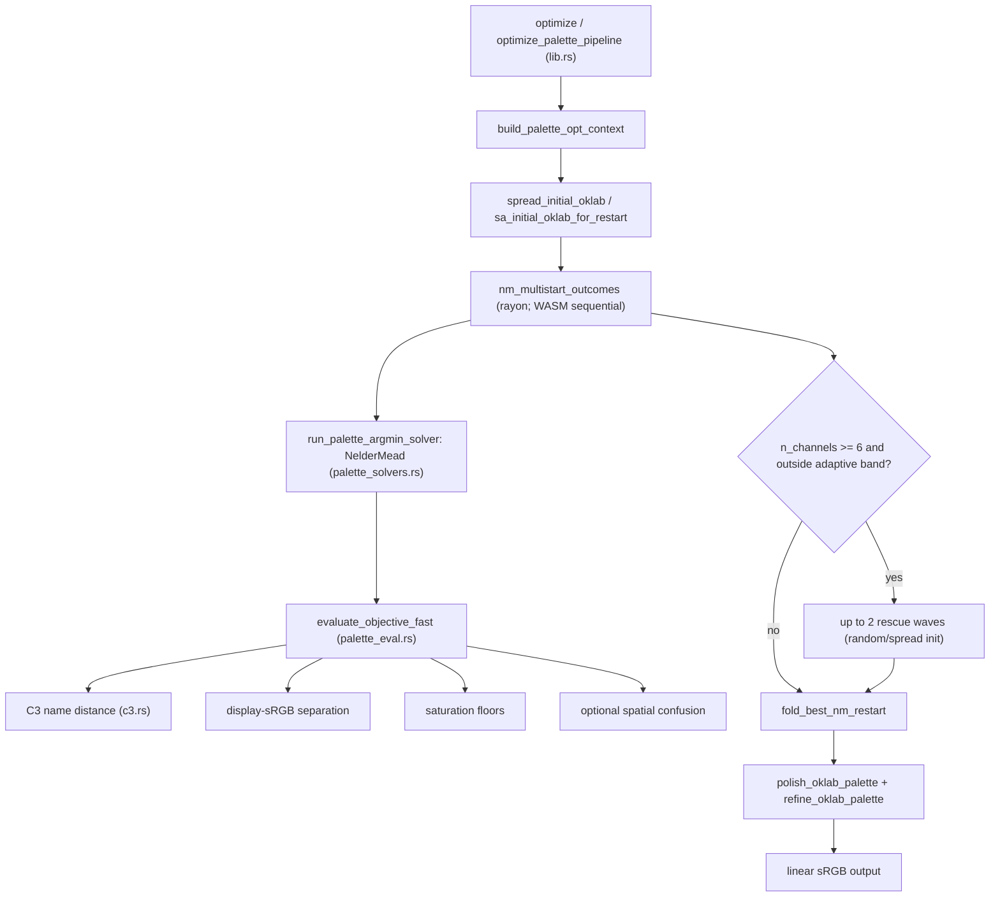

# Palette Optimization: Objective, Code, and Experiment Log

Working notes on the multi-channel pseudocoloring palette optimizer in `psudo`.
Covers the overall goal, how the code is structured, everything we've tried so
far, and the results of each experiment.

---

## 1. Overall objective

Assign a distinct color to each channel of a multi-channel image for
pseudocoloring. A good palette should:

- **Distribute color names** — channels should read as clearly different colors
  (avoid red+pink, two greens, two yellows).
- **Distribute hues** — colors should spread around the wheel rather than
  clustering in one warm/cool region.
- Stay **saturated** (not pale/greyish) and **perceptually separable**.
- Avoid muddy **brown/yellow/olive** collapses.

Colors are optimized in **OKLab** `(L, a, b)` per channel; the optimizer searches
that continuous space to minimize a composite loss. Hue is emergent from the
OKLab coordinates, not assigned from fixed slots.

---

## 2. Current objective (production)

Minimized total (`L_tot`), lower is better. Defined in
[`lib/src/palette_eval.rs`](../lib/src/palette_eval.rs) `evaluate_objective_fast`
(~106–170) and constants in [`lib/src/lib.rs`](../lib/src/lib.rs) (~193–215):

```
L_tot = −mean C3 name distance          # linguistic separation (C3 model)
      + (−min display-sRGB Δ / 255)     # perceptual separation reward
      + perceptual_deficit              # penalty below MIN_DISPLAY_RGB_DISTANCE
      + term_loss                       # exclude grey/white; honor user names
      + w_spatial · confusion           # optional multi-channel mix decodability
      + (−w_sat · min(chroma, sat))     # reward on dullest channel
      + saturation_deficit              # penalty below chroma / sat floors
```

Key constants (current values):

- `MIN_DISPLAY_RGB_DISTANCE = 90.0`, `PERCEPTUAL_SCALE = 255.0`,
  `PERCEPTUAL_DEFICIT_WEIGHT = 6.0`
- `DEFAULT_MIN_OKLAB_CHROMA = 0.16`, `MIN_SRGB_SATURATION = 0.42`,
  `SATURATION_DEFICIT_WEIGHT = 10.0`, `MIN_SAT_REWARD_WEIGHT = 2.5`
- `SPATIAL_CONFUSION_WEIGHT = 0.1` (native default on; WASM default off)
- `DEFAULT_EXCLUDED_COLOR_NAMES`: grey/white family only

Notes:

- The **perceptual term uses Euclidean display-sRGB distance (0–255)**, not
  CIEDE2000. This has been true in every committed revision: `git log -S
  "Ciede2000"` and `-S "MIN_PERCEPTUAL_DE2000"` return **no commits**, i.e.
  CIEDE2000 was discussed in-session but never landed in the tree. A legacy JS key
  is misnamed `min_perceptual_de2000` but the value it carries is display-RGB
  distance.
- C3 name distance is the **mean** of pairwise `(1 − cosine)` similarity — see
  [`lib/src/c3.rs`](../lib/src/c3.rs) `average_pairwise_color_name_distance`
  (~69–86). One bad pair (red/pink) can be masked by other good pairs.

---

## 3. Code architecture



Key files:

- [`lib/src/lib.rs`](../lib/src/lib.rs) — pipeline, objective constants, init,
  polish/refine, rescue, WASM bindings.
- [`lib/src/palette_eval.rs`](../lib/src/palette_eval.rs) — fast per-eval
  objective (`evaluate_objective_fast`).
- [`lib/src/c3.rs`](../lib/src/c3.rs) — C3 color-naming distances.
- [`lib/src/palette_solvers.rs`](../lib/src/palette_solvers.rs) — argmin solver
  dispatch (NM production; SA/PSO/L-BFGS/steepest/polish-only for benchmarks).
- [`lib/npm/index.js`](../lib/npm/index.js) — async WASM worker pool mirroring the
  Rust rescue/restart logic.

Solver defaults (production NM multistart):

- `DEFAULT_MAX_ITERS = 3000` (NM iters = budget/2, scaled ×`n/3`)
- `DEFAULT_NUM_RESTARTS = 18` (working tree; was 12 at HEAD), scaled ×`n/3`,
  clamped native `(4,40)` / WASM `(1,32)`
- Init: restart 0 = RGB primaries + ring extras; later restarts ~⅔ random
  saturated OKLab (`restart % 3 != 0`), rest jittered spread
- Rescue: only `n ≥ 6`, adaptive band, up to 2 waves
- Postprocess: coordinate polish + single-channel jitter refine

### Study / evaluation tooling

- `cargo run --example palette_study --release` →
  `lib/target/palette_study/report.html` (swatches, C3 name + `hue_deg` debug,
  loss breakdown bars; env `PALETTE_STUDY_*`).
- `pnpm run palette-study-wasm`, `palette-study-compare` (native vs WASM parity).
- `param_sweep`, `solver_benchmark`, `solver_hyperparam_sweep` examples.
- `opt_eval_tests.rs` — red/pink and pastel failure-mode unit tests;
  `c3_migration_tests.rs` — C3 parity.

---

## 4. Git history and optimizer evolution

How the current optimizer was arrived at (most recent first). Everything in
sections 5.1–5.4 below happened *in-session on top of* `551f82f` and was largely
reverted; the committed lineage is what actually shipped.

| Commit | Date | What it did to the optimizer |
|--------|------|------------------------------|
| working tree | 2026-07-15 | Uncommitted: restarts 12→18; init diversity `restart % 3` (see 5.3) |
| `551f82f` | 2026-07-14 | "Fixing optimization" — major NM tuning (detailed below) |
| `ed10607` | 2026-06-02 | Deploy to GitHub Pages (no optimizer change) |
| `67cf379` | 2026-05-20 | v0.4.1; touched `SPATIAL_CONFUSION_WEIGHT` |
| `7b80d87` | 2026-05-19 | `Cargo.toml` opt tweak (1 line) |
| `0cdd163` | 2026-05-19 | Web-worker pool; split out `palette_eval.rs` |
| `4751f7b` | 2026-05-19 | v0.3.0: Nelder–Mead defaults, `rust_c3` 0.3 WASM |
| `7b636b2` | 2026-05-18 | "Optimizing method without spatial overlap" — the foundation |

### 4.1 `7b636b2` — the current optimizer foundation

The large rewrite (+10054/−16685 lines, mostly `package-lock`→`pnpm-lock`) that
established today's approach. In `lib/src/lib.rs` (1502 lines changed) it
introduced:

- The **display-sRGB Euclidean separation** term (`MIN_DISPLAY_RGB_DISTANCE`) —
  the perceptual term has used this ever since (never CIEDE2000).
- The **mean C3 name distance** term
  (`average_pairwise_color_name_distance`).
- The multistart Nelder–Mead pipeline, `spread_initial_oklab` /
  `random_initial_oklab`, saturation floors, and the study harness
  (`lib/examples/palette_study.rs`) + `opt_eval_tests.rs`.

### 4.2 `551f82f` — "Fixing optimization" (current HEAD)

The most recent committed optimizer work (+173/−35 in `lib.rs`). This is the
production baseline the user considers "somewhat better" than later experiments:

- **More search budget:** `DEFAULT_NUM_RESTARTS` 6→12 (native + WASM); restart
  clamp bounds widened native `(4,16)`→`(4,40)`, WASM `(1,12)`→`(1,32)`.
- **Adaptive rescue** replaced fixed 6-channel thresholds. Deleted
  `SIX_CH_MIN_RGB_RESCUE = 190.0` / `SIX_CH_L_TOT_RESCUE = −3.85`; added
  `adaptive_rescue_band(outcomes)` that derives `(l_tot_rescue, rgb_rescue)` from
  the current wave's own best/spread, plus up to **2 rescue waves** for `n ≥ 6`
  with `HIGH_CH_RESCUE_RESTARTS_BASE = 5` scaled by channel count.
- **RGB-primary-led init:** new `srgb_primary_oklab(which)` seeds channels 0–2
  with clamped R/G/B primaries, then evenly spaced hues for the rest — gives NM a
  strong distinct basin. `spread_initial_oklab` rewritten accordingly.
- **Per-restart init diversity:** new `sa_initial_oklab_for_restart(...)` — random
  saturated inits kick in only for `restart > 0`, with fraction `k = max(2,
  12/n)` (more random at low `n`).
- **Channel-scaled simplex:** `nm_perturb_scale_for_channels(n)` = `1 + 0.06·(n−3)`
  clamped, replacing the flat `1.35` for `n ≥ 6`.
- **Robustness:** NM `run_palette_argmin_solver` errors (degenerate simplex / NaN)
  now fall back to the init instead of `panic!`, so a bad restart no longer kills
  the whole optimize.

---

## 5. Experiments tried and results

Sections 5.1–5.4 are the in-session A/B work done on top of `551f82f`. Net
committed result of all of it: only the restart-count/init-diversity bump in the
working tree; every objective-formula change was reverted.

### 5.1 A/B variant study (isolated one-knob changes)

We built a paired baseline-vs-variant study (each variant flips exactly one
behavior; same seeds) and reviewed results visually. Variants tried:

| Variant | What it changed | Result |
|---------|-----------------|--------|
| `min_name` | Add `−w·min` pairwise C3 name distance (keep mean) | **Good** — best single win; targets worst-pair (red/pink) |
| `stronger_perc` | Raise perceptual deficit weight 6 → 12 | **Better** — helped separation |
| `softmin_name` | Replace mean name distance with softmin | **Bad** — rejected |
| `name_collision` | Penalize channels sharing dominant C3 term | **No profound difference** — weak |
| `hue_sep` | Penalize min OKLab hue gap below ~360°/n | **Bad** — caused weird browns/yellows |
| `even_hue_init` | Init all channels on even full hue ring | **Kinda bad** |

### 5.2 Promote winners to production, A/B vs legacy

Folded `min_name` (always-on min-name term) + `stronger_perc` (deficit weight
6→12) into the baseline objective; added a `legacy` variant to A/B the combined
change against the old objective.

- **Result: legacy (old objective) was still somewhat better.** Stacking the two
  isolated wins changed the loss landscape; Nelder–Mead did not reliably land the
  better basins that the isolated wins suggested.

### 5.3 More random restarts

Increased `DEFAULT_NUM_RESTARTS` 12 → 18 (native/WASM/npm/study) and changed init
diversity from seed-modulo to restart-index based (~⅔ random inits after restart
0).

- **Result: didn't really help.** Suggests the problem is basin shape / objective
  mismatch, not sampling volume.

### 5.4 Current repository state

The objective-formula experiments (`min_name`, `stronger_perc`, the
`PaletteVariant` enum, `palette_variants.rs`, `palette_variant_study.rs`, and the
associated `opt_eval_tests`) were **reverted**. The proposed CIEDE2000 swap was
never committed at any point. Production objective is back to **mean C3 name +
display-sRGB separation + perceptual deficit weight 6**.

Uncommitted working-tree diff (vs HEAD `551f82f`), confirmed by `git diff --stat`:

- `lib/src/lib.rs` — `DEFAULT_NUM_RESTARTS` (+ WASM) 12→18; `sa_initial_oklab_for_restart`
  diversity switched from `init_seed % k` to `restart % 3 != 0`
- `lib/npm/index.js` — `DEFAULT_NUM_RESTARTS` 12→18 (worker-pool parity)
- `scripts/palette-study-lib.mjs` — `DEFAULT_RESTARTS` →18
- `lib/examples/palette_study.rs` — `DEFAULT_RESTARTS` 6→18 (match production)

Nothing in the working tree changes the objective formula; it is purely a
search-budget / init-diversity delta on top of `551f82f`.

---

## 6. Diagnosis / open bottlenecks

Three orthogonal reasons quality still lags:

1. **Objective geometry** — mean name distance + RGB Euclidean don't force
   *distinct names* or clean hue families; earth-tone (brown/yellow/olive)
   attractors clear the RGB and saturation gates.
2. **Search geometry** — Cartesian `a,b` mutations in anneal/refine/polish walk
   through brown/olive corridors. **Post-fold polar OKLCh refine (Exp 4) did not
   beat total in human review** (mostly ties; total preferred when they differed),
   so search-geometry alone at refine time is not the lever.
3. **Process** — single-phase minimize-`L_tot` conflates "good score" with "good
   palette." Best `L_tot` ≠ best-looking palette. More NM restarts can't add a
   constraint that isn't in `L_tot`.

### Candidate directions (active)

- **OKLab separation (`oklab_sep`)** — replace display-sRGB Euclidean min/deficit
  with OKLab Euclidean in the perceptual terms (search already in OKLab; sRGB
  separation saturates at RGB corners while red+pink remains). Study/review only;
  production stays sRGB separation. **Pending human review.**
  Constants: `MIN_OKLAB_DISTANCE=0.20`, `OKLAB_PERCEPTUAL_SCALE=0.50` (pink≈0.09
  below floor; blue≈0.35 above; term magnitudes ~ match `−min_rgb/255`).
  Distances use **display-projected** OKLab (OKLab → clamp sRGB → OKLab) so
  out-of-gamut preimages that clip to the same hex are not rewarded.

### Deprioritized (C3-centric — do not spend more cycles here first)

- Soft-exclude earth-tone C3 names via `term_loss`
- Promoting `min_name` (mean+min C3) — flag remains for ablation; not blocking
- Further Lex / name_tail / Glasbey selection knobs

Next *if* `oklab_sep` ties or loses: in-search OKLCh proposals under the better
metric (not more C3 ranking).

### Tried / human-reviewed (do not promote)

- **Lex / name_tail selection** (`PSUDO_PALETTE_SELECTION`) — INIT=current total
  30/40 preferred; Lex not preferred. INIT=mixed (`mixed_40_1784135715`): total
  **27**/40; lex_v2 **11**/20 on 4ch only; **6ch total 20/20**. Fast votes
  (~2–3s/case). **Do not promote Lex or name_tail as production default.**
- **Glasbey / mixed init** — did not fix 6ch (total 20/20 on 6ch).
- **Polar OKLCh refine (Exp 4)** — `PSUDO_REFINE=cartesian|polar|hybrid` vs total
  on the same pool winner: **mostly ties; when they differed, total was better.**
  Do **not** promote polar/hybrid or study soft-accept as production default.
  Keep Cartesian + strict `L_tot`. Code/flags may remain for ablation.

Rejected (do not revisit): softmin name, continuous hue-gap soft term,
even-hue-init alone, raising restarts further, blind solver swaps (NM→PSO/L-BFGS)
without objective/init changes, **post-fold polar/hybrid refine as a quality fix**,
**C3 selection / init ranking as the primary 6ch fix**.

---

## 7. Quick reference

| Command | Purpose |
|---------|---------|
| `cd lib && cargo run --example palette_study --release` | Native study HTML |
| `PALETTE_STUDY_PARENTS=20 PALETTE_STUDY_CHANNELS=4,6 PSUDO_REVIEW_METHODS=total,oklab_sep cargo run --example palette_study --release` | Interactive total vs OKLab-separation review |
| `pnpm run palette-study-wasm` | WASM study HTML |
| `pnpm run palette-study-compare` | Native vs WASM parity |
| `cargo test -p psudo opt_eval -- --nocapture` | Failure-mode unit tests |
| `cargo test -p psudo c3_migration --release` | C3 parity tests |

Study output: `lib/target/palette_study/report.html` (swatches + C3 name/hue
debug + loss breakdown, sorted by `L_tot`).
